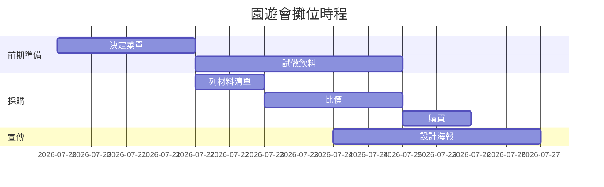

# 🎯 專案管理 10 天入門學習計畫

> 最後更新：2026-07-15
> 對象:完全沒學過專案管理的新手
> 方式:每天約 1 小時（30 分鐘理論 + 30 分鐘實作）

---

## 🤔 什麼是專案管理？（先聽我用白話講）

想像一下：班上要辦**園遊會擺攤**，你被選為負責人。

你要決定賣什麼、誰去買材料、誰顧攤位、要花多少錢、來不來得及在園遊會當天準備好……如果你什麼都不規劃，當天一定大亂：材料忘了買、沒人顧攤、錢超支。

**專案管理，就是「把一件有期限的大事，拆成一堆小事，安排好誰做、什麼時候做、花多少錢，然後盯著它完成」的技術。**

幾個重點名詞，先混個臉熟就好：

| 名詞 | 白話解釋 |
|------|---------|
| 專案（Project） | 有開始、有結束、有目標的一件大事（例如：辦園遊會攤位） |
| 範疇（Scope） | 這件事「要做什麼」和「不做什麼」（賣飲料 ✅，順便賣雞排 ❌ 太貪心） |
| 時程（Schedule） | 什麼事情要在什麼時候做完 |
| 資源（Resource） | 人力、錢、材料、時間 |
| 風險（Risk） | 可能出包的事（下雨怎麼辦？材料漲價怎麼辦？） |
| 利害關係人（Stakeholder） | 跟這件事有關、會關心結果的人（老師、同學、來買的客人） |

> 💡 生活中到處都是專案：準備段考、規劃畢業旅行、練一首歌參加成發——你其實早就在做專案管理了，只是沒有系統化而已！

---

## 🏕️ 你的實作專案

這 10 天，你會一邊學理論、一邊完成一個完整的模擬專案：

> **「規劃班級園遊會攤位」**（也可以換成你自己想做的事，例如辦生日派對、規劃三天兩夜家庭旅遊）

每天的實作都會累積成果，第 10 天你會擁有一整套自己做出來的專案文件！

📁 建議在這個資料夾建立 `my-project/` 資料夾，把每天的實作成果存進去。

---

## 📅 十天學習地圖

| 天數 | 主題 | 學到的核心技能 |
|------|------|--------------|
| Day 1 | 什麼是專案？ | 分辨專案 vs 日常工作 |
| Day 2 | 訂目標與範疇 | 專案章程、SMART 目標 |
| Day 3 | 拆解任務（WBS） | 把大事拆成小事 |
| Day 4 | 排時程 | 甘特圖、任務的先後順序 |
| Day 5 | 分工與資源 | 誰做什麼、預算怎麼抓 |
| Day 6 | 風險管理 | 預想出包，先想好備案 |
| Day 7 | 溝通與會議 | 開有效率的會、寫會議紀錄 |
| Day 8 | 追蹤進度 | 燈號、週報、處理落後 |
| Day 9 | 應付變化 | 需求變更怎麼辦 |
| Day 10 | 結案與回顧 | 總驗收、經驗教訓 |

---

## Day 1：什麼是專案？

### 📖 理論（30 分鐘）

**專案有三個特徵：**

1. **有明確的開始和結束**——園遊會是 X 月 X 日，過了就結束了。每天寫作業不是專案（因為天天都有，沒有結束的一天），那叫「例行工作」。
2. **有獨特的目標**——做出一個「以前沒有的東西」，例如一個新攤位。
3. **資源有限**——錢有限、人有限、時間有限。如果錢和時間無限，就不需要管理了 😆

**專案管理的鐵三角：**

```
        時間（快）
        /      \
       /        \
   成本（省）——品質（好）
```

「又快、又省、又好」通常不可能同時做到，只能三選二。想要快又好？那就要多花錢。想要省錢又好？那就要多花時間。這就是 PM（專案經理）每天在做的取捨！

### ✏️ 實作（30 分鐘）

1. 拿一張紙（或開一個 `day01.md`），寫下你生活中做過的 5 件事
2. 判斷哪些是「專案」、哪些是「例行工作」，寫下理由
3. 從專案裡挑一個當作這 10 天的實作題目（推薦：園遊會攤位）
4. 用一句話寫下這個專案的目標，例如：「在園遊會當天賣珍珠奶茶，賺到 3000 元」

✅ **今日產出**：`day01.md`——你的專案題目 + 一句話目標

---

## Day 2：訂目標與範疇

### 📖 理論（30 分鐘）

**爛目標 vs 好目標：**

- ❌「攤位要辦得很成功」——什麼叫成功？沒人知道
- ✅「園遊會當天賣出 150 杯飲料，營收 3000 元，收攤時垃圾清完」——具體、可以驗收！

好目標要符合 **SMART 原則**：

| 字母 | 意思 | 範例 |
|------|------|------|
| **S**pecific | 具體 | 賣珍珠奶茶（不是「賣點東西」） |
| **M**easurable | 可衡量 | 150 杯、3000 元 |
| **A**chievable | 做得到 | 全班 30 人+家長會來，150 杯合理 |
| **R**elevant | 有意義 | 賺班費，畢旅基金 +1 |
| **T**ime-bound | 有期限 | 園遊會當天 09:00–14:00 |

**範疇（Scope）＝ 要做什麼 + 不做什麼。**
「不做什麼」超級重要！很多專案失敗，就是因為一直加東西（這叫**範疇蔓延 Scope Creep**）——本來只賣飲料，有人說加賣雞排、有人說加撈金魚，最後什麼都做不好。

### ✏️ 實作（30 分鐘）

建立 `day02-專案章程.md`，寫出你的迷你「專案章程」：

```markdown
# 專案章程：{你的專案名稱}
- 目標（SMART）：
- 要做的事（範疇內）：1. …  2. …  3. …
- 不做的事（範疇外）：1. …  2. …
- 期限：
- 預算：
- 利害關係人：誰會關心這件事？他們希望看到什麼？
```

✅ **今日產出**：一頁專案章程

---

## Day 3：拆解任務（WBS）

### 📖 理論（30 分鐘）

「辦好攤位」這件事太大了，大到不知道從哪開始。所以要**拆解**！

**WBS（Work Breakdown Structure，工作分解結構）**＝把大事拆成中事，中事拆成小事，直到每件小事都「知道怎麼做、一個人幾天內能完成」。

```
辦園遊會飲料攤
├── 1. 前期準備
│   ├── 1.1 決定菜單和價格
│   ├── 1.2 試做飲料、調整配方
│   └── 1.3 申請攤位、確認用電
├── 2. 採購
│   ├── 2.1 列材料清單
│   ├── 2.2 比價（至少 2 家）
│   └── 2.3 購買材料和器材
├── 3. 宣傳
│   ├── 3.1 設計海報
│   └── 3.2 社群宣傳（班群、IG）
└── 4. 當天執行
    ├── 4.1 布置攤位
    ├── 4.2 輪班表
    └── 4.3 收攤與清潔
```

**拆解的訣竅：**
- 每個小任務都用「動詞開頭」：決定～、購買～、設計～
- 拆到「2～3 天內可以完成」的大小就夠了
- 檢查：所有小任務加起來，能不能 100% 完成大目標？有沒有漏掉什麼？

### ✏️ 實作（30 分鐘）

建立 `day03-wbs.md`，把你的專案拆成 3～5 個大類，每類拆出 2～4 個小任務（總共 10～15 個小任務）。

✅ **今日產出**：你的專案 WBS（10～15 個小任務）

---

## Day 4：排時程

### 📖 理論（30 分鐘）

任務列出來了，接下來排「什麼時候做」。兩個重要觀念：

**1. 依賴關係（Dependency）**：有些事必須先做完，別的事才能開始。
　「列材料清單」→ 才能「比價」→ 才能「購買」。順序錯了就會卡住。

**2. 甘特圖（Gantt Chart）**：把任務畫在時間軸上的長條圖，一眼看出每件事的起訖時間和重疊狀況。



**3. 要害路徑（關鍵路徑）**：從頭到尾「最長的那條必經路線」。這條路上的任務只要遲到一天，整個專案就遲到一天！所以 PM 會特別盯緊這些任務。

**小技巧：抓緩衝（Buffer）**——排時程時預留 10～20% 的彈性時間，因為事情永遠比想像中花時間 😅

### ✏️ 實作（30 分鐘）

建立 `day04-時程表.md`：

1. 幫 Day 3 的每個任務標上「需要幾天」和「前置任務」
2. 倒推排程：從專案截止日往回推，排出每個任務的開始/結束日期
3. 加分題：畫成甘特圖（手繪拍照、Excel，或請 Claude 幫你產 Mermaid 甘特圖）

✅ **今日產出**：有日期、有先後順序的時程表

---

## Day 5：分工與資源

### 📖 理論（30 分鐘）

**分工的黃金原則：每個任務都要有「一個」負責人（Owner）。**

注意是「一個」！如果一個任務寫「大家一起負責」，結果就是**沒有人負責**（每個人都以為別人會做）。可以很多人幫忙，但只能有一個人「對結果負責」。

**分工表（簡化版 RACI）：**

| 任務 | 負責人 | 幫忙的人 | 需要告知誰 |
|------|--------|---------|-----------|
| 設計海報 | 小美 | 小華 | 全班 |
| 採購材料 | 小明 | 小強、小明媽媽(開車) | 班導 |

**分工時考慮：** 每個人的專長（會畫畫的做海報）、時間（補習多的少排一點）、意願（有熱情做得快）。

**預算怎麼抓：** 列出所有要花錢的項目 → 查價或估價 → 加總 → **再加 10% 預備金**（一定會有意外支出！）

### ✏️ 實作（30 分鐘）

建立 `day05-分工預算.md`：

1. 幫每個任務指定一位負責人（自己模擬也行：小明、小美、小華…）
2. 列出預算表：項目、數量、單價、小計，最後加 10% 預備金
3. 檢查：有沒有人被分太多工作？（一個人扛 8 個任務就是紅燈🚨）

✅ **今日產出**：分工表 + 預算表

---

## Day 6：風險管理

### 📖 理論（30 分鐘）

**風險＝還沒發生、但可能發生的壞事。** PM 的厲害之處不是「事情出包後救火」，而是「事情還沒出包就先想好怎麼辦」。

**風險管理三步驟：**

1. **找出來**：腦力激盪「什麼事可能出包？」（下雨、有人生病、材料漲價、飲料賣不完…）
2. **評分**：機率（1～5 分）× 影響（1～5 分）= 風險分數。分數高的優先處理
3. **想對策**，有四招：

| 策略 | 意思 | 範例 |
|------|------|------|
| 規避 | 改變計畫，讓風險不會發生 | 怕食物中毒 → 改賣包裝飲料 |
| 減輕 | 降低機率或影響 | 怕下雨 → 借帳篷、準備雨遮 |
| 轉移 | 讓別人承擔 | 器材跟廠商租(壞了廠商負責) |
| 接受 | 風險小，發生了再說 | 吸管顏色跟海報不搭 → 算了吧 |

**風險登錄表範例：**

| 風險 | 機率 | 影響 | 分數 | 對策 | 負責人 |
|------|-----:|-----:|-----:|------|--------|
| 當天下雨 | 3 | 4 | 12 🔴 | 減輕：借帳篷 | 小明 |
| 顧攤同學臨時請假 | 3 | 3 | 9 🟡 | 減輕：排 2 位備援 | 小美 |
| 材料買太少不夠賣 | 2 | 3 | 6 🟢 | 接受：賣完提早收攤 | — |

### ✏️ 實作（30 分鐘）

建立 `day06-風險登錄表.md`，為你的專案列出**至少 5 個風險**，評分並寫出對策。

💡 挑戰：找家人或朋友問「你覺得這計畫哪裡會出包？」——別人常常看得到你的盲點！

✅ **今日產出**：至少 5 條風險的風險登錄表

---

## Day 7：溝通與會議

### 📖 理論（30 分鐘）

專案失敗的第一名原因，不是技術問題，是**溝通不良**——「我以為你要做」「我沒聽說要改」「你怎麼沒跟我講」……

**有效會議三寶：**

1. **會前有議程**：要討論什麼、每題幾分鐘、要做出什麼決定。沒議程的會議＝聊天
2. **會中有記錄**：誰說了什麼不重要，**決定了什麼**和**誰要去做什麼**才重要
3. **會後有追蹤**：行動項目（Action Item）要有負責人和期限，下次開會先追進度

**會議紀錄的靈魂——行動項目：**

```markdown
## 行動項目
| # | 任務 | 負責人 | 期限 | 狀態 |
|---|------|--------|------|------|
| 1 | 問學務處能不能借帳篷 | 小明 | 7/25 | 進行中 |
| 2 | 海報初稿給大家看 | 小美 | 7/26 | 未開始 |
```

**溝通的頻率原則：** 越重要的利害關係人，越要主動、定期回報。班導不用知道吸管買哪牌，但預算超支一定要第一時間講！

### ✏️ 實作（30 分鐘）

模擬一場 15 分鐘的「專案啟動會議」（可以找家人朋友演，或自己一人分飾多角😆）：

1. 先寫議程（3 個議題）
2. 「開完會」後寫會議紀錄：討論摘要、決議事項、行動項目
3. 存成 `day07-會議紀錄.md`

✅ **今日產出**：一份議程 + 一份會議紀錄

---

## Day 8：追蹤進度

### 📖 理論（30 分鐘）

計畫排得再漂亮，不追蹤就會歪掉。PM 每週要問三個問題：

1. **這週完成了什麼？**（跟計畫比，有沒有落後？）
2. **下週要做什麼？**
3. **有什麼卡住的地方（Blocker）？需要誰幫忙？**

**燈號系統**——用一個顏色讓所有人秒懂專案狀態：

- 🟢 **綠燈**：一切照計畫走
- 🟡 **黃燈**：有點落後或有隱憂，但有辦法救回來
- 🔴 **紅燈**：嚴重落後或大問題，需要外部支援（要有勇氣亮紅燈！隱瞞問題只會更慘）

**發現落後怎麼辦？四個選項：**

1. **加人**：找更多同學幫忙
2. **加時間**：跟老師申請延後（如果可以的話）
3. **減範疇**：原本賣 3 種飲料，改賣 2 種
4. **降品質**：海報從手繪改成簡單輸出（謹慎使用！）

### ✏️ 實作（30 分鐘）

模擬情境：假設你的專案已經進行一週，其中 2 個任務落後了（自己挑 2 個）。

建立 `day08-週報.md`：

```markdown
# 週報：{專案名稱}（第 1 週）
## 燈號：🟡
（一句話：為什麼是黃燈）
## 本週完成
## 下週計畫
## 卡住的地方 & 需要的協助
## 我的補救方案
（用「加人/加時間/減範疇/降品質」分析要選哪招，為什麼）
```

✅ **今日產出**：一份有燈號、有補救方案的週報

---

## Day 9：應付變化

### 📖 理論（30 分鐘）

計畫趕不上變化，這是專案的日常。重點不是「拒絕所有變化」，而是**「有程序地處理變化」**。

**情境**：園遊會前三天，班長說「隔壁班也賣飲料！我們加賣鬆餅好不好？」

菜鳥 PM：「好啊好啊！」→ 三天後：鬆餅機沒著落、預算爆掉、人力不夠，連本來的飲料都搞砸 💀

專業 PM 的**變更管理四步驟**：

1. **先別急著答應**——說「讓我評估一下影響」
2. **評估四個面向**：
   - ⏰ 時程：來得及嗎？（剩 3 天，要買機器、試做、學會操作…）
   - 💰 成本：預算夠嗎？（鬆餅機+材料至少多 1500 元）
   - 👥 人力：有人做嗎？（現有輪班表已經排滿）
   - ⚠️ 風險：新風險？（沒人做過鬆餅，當天手忙腳亂的機率超高）
3. **給出選項**，而不是只說好/不好：
   - A：不加鬆餅，改用「買飲料送小餅乾」差異化（成本 +200，風險低）
   - B：加賣鬆餅，但砍掉一種飲料，跟家長借鬆餅機（成本 +800，風險中）
   - C：完整加賣鬆餅（成本 +1500，風險高，不建議）
4. **決定後記錄下來**——誰決定的、為什麼，寫成「決策紀錄」，以後不會吵「當初是誰說要加的！」

### ✏️ 實作（30 分鐘）

幫你的專案設計一個「突發變更」情境（或用上面的鬆餅事件），建立 `day09-變更評估.md`：

```markdown
# 變更評估：{變更內容}
## 背景：誰提出、為什麼
## 影響評估：時程／成本／人力／風險
## 方案比較：A / B / C（各自的優缺點）
## 我的建議與理由
## 最終決議
```

✅ **今日產出**：一份變更評估與決策紀錄

---

## Day 10：結案與回顧

### 📖 理論（30 分鐘）

專案結束≠收東西回家而已。**專業的結尾有三件事：**

1. **驗收**：對照 Day 2 的 SMART 目標——達成了嗎？（賣了幾杯？賺了多少？）誠實面對數字
2. **回顧（Retrospective）**：全隊一起討論三個問題：
   - 👍 **哪些做得好？**（下次繼續）
   - 👎 **哪些做不好？**（下次避免）
   - 💡 **下次要嘗試什麼？**（具體改善行動）
   - 重點：**對事不對人**！說「採購太晚啟動」，不說「都是小明太混」
3. **歸檔**：把所有文件收好。下次辦活動的學弟妹（或半年後的你）會感謝現在的你

**經驗教訓（Lessons Learned）才是專案最值錢的產出**——錢會花完、攤位會拆掉，但學到的東西會跟著你一輩子。

### ✏️ 實作（30 分鐘）

1. 建立 `day10-結案報告.md`：

```markdown
# 結案報告：{專案名稱}
## 目標達成度（假設專案已完成，模擬填寫）
## 計畫 vs 實際（時程、預算）
## 做得好的 3 件事
## 做不好的 3 件事
## 給下一次的 3 個建議
```

2. **十天總回顧**：翻回 Day 1 的筆記，寫下這 10 天你觀念改變最大的 3 件事

✅ **今日產出**：結案報告 + 你的學習總回顧

---

## 🎓 恭喜完賽！接下來呢？

完成 10 天後，你已經擁有：

- ✅ 一整套自己做的專案文件（章程、WBS、時程、分工、預算、風險、會議紀錄、週報、變更評估、結案報告）
- ✅ 專案管理的完整思考框架

**下一步建議：**

1. **來真的！** 找一件真實的事（社團活動、讀書計畫、家庭旅遊）用這套方法跑一遍
2. **學工具**：試試 Trello、Notion 這類免費工具管理任務
3. **進階閱讀**：搜尋「敏捷開發 Agile」「Scrum」——另一種適合快速變化的專案管理方法
4. **在這個工作區練習**：直接跟 Claude 說「開新專案」，用真實專案實戰！

> 🌟 記住:專案管理不是填表格，是一種「把事情想清楚、做到底」的思考習慣。表格只是幫你思考的工具而已。加油！
